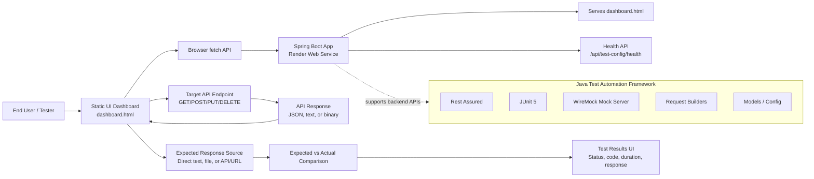
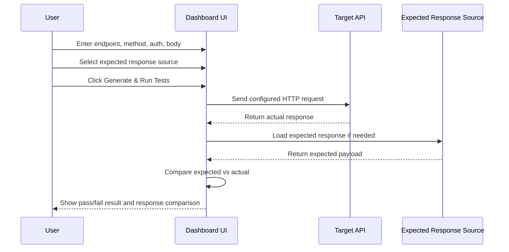
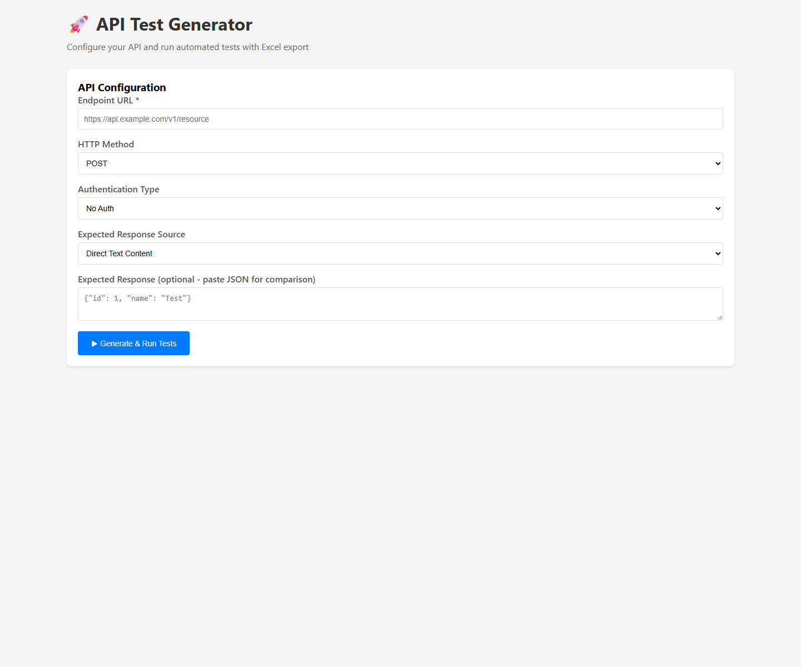
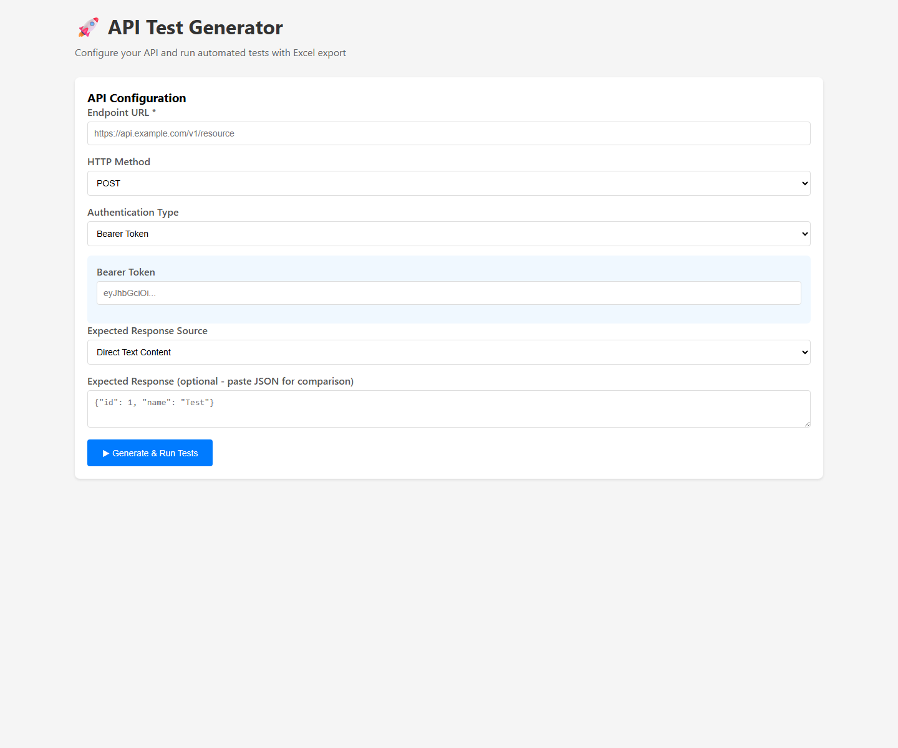
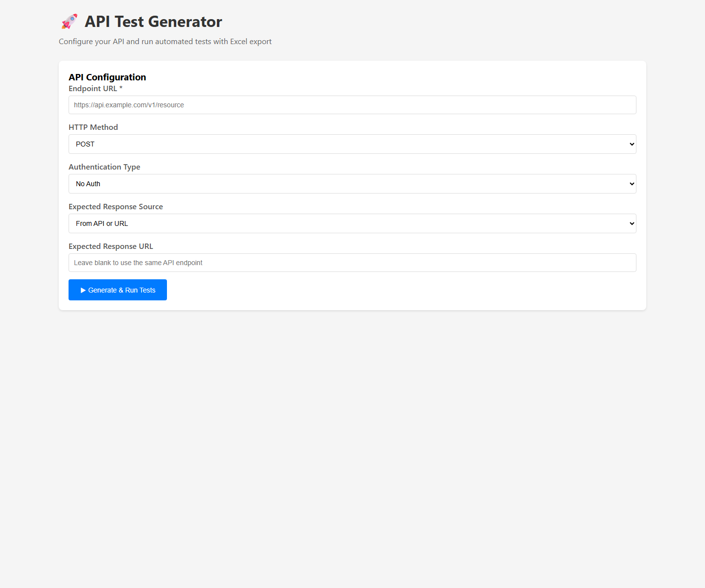
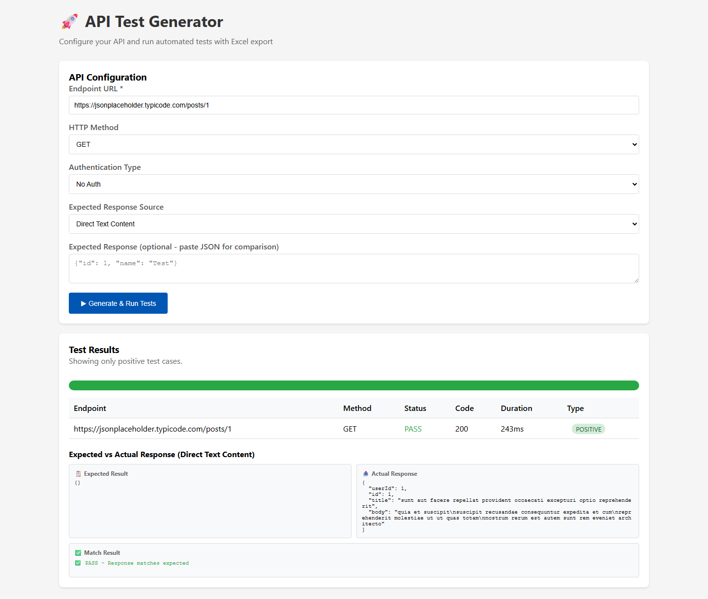

# 🚀 RestAssured API Test Automation Framework

A web-based API testing dashboard backed by a Spring Boot application. It helps business users, testers, and developers run API requests, validate responses, compare expected vs actual payloads, and understand results without writing test code.

## 🌐 Live Application

The application is deployed on Render:

```text
https://rest-assured-test-automation.onrender.com
```

Dashboard:

```text
https://rest-assured-test-automation.onrender.com/dashboard.html
```

Health check:

```text
https://rest-assured-test-automation.onrender.com/api/test-config/health
```

## 🎯 Purpose of the App

This app is designed to make API testing simple and repeatable.

You can use it to:

- Call any REST API endpoint from the browser.
- Test `GET`, `POST`, `PUT`, and `DELETE` requests.
- Add authentication using Basic Auth, OAuth2, API Key, Bearer Token, Okta Token, or a raw `Authorization` header.
- Send JSON request bodies for `POST` and `PUT`.
- Load expected responses from direct text, a file, or another API/URL.
- Compare expected vs actual response content.
- View pass/fail status, HTTP status code, duration, and response details.
- Avoid duplicate API calls when the expected response URL is the same as the test endpoint.
- Handle binary responses such as audio streams.

The UI currently runs only the **Positive Test** flow, so the dashboard focuses on happy-path API validation.

## 🏗️ Architecture Diagram



## 🧩 Main Components

| Component | Location | Purpose |
|---|---|---|
| Spring Boot App | `src/main/java/com/company/api` | Runs the backend and serves the UI |
| UI Dashboard | `src/main/resources/static/dashboard.html` | Form-based API testing interface |
| API Config Controller | `src/main/java/com/company/api/config/ApiTestConfigController.java` | Exposes API test configuration endpoints |
| Java Test Framework | `src/test/java/com/company/api` | Rest Assured, JUnit, WireMock, builders, and generated tests |
| Render Config | `render.yaml` | Defines the Render web service |
| Dockerfile | `Dockerfile` | Builds the Spring Boot app for Render |
| Screenshots | `docs/screenshots/` | Playwright-captured UI pages |

## 🖥️ UI Architecture Flow



## 🚀 How to Use the App - Step by Step

### Step 1: Open the Dashboard

Open:

```text
https://rest-assured-test-automation.onrender.com/dashboard.html
```

You should see the API configuration form.

### Step 2: Enter the API Endpoint

Enter the full API URL in **Endpoint URL**.

Example:

```text
https://jsonplaceholder.typicode.com/posts/1
```

### Step 3: Select the HTTP Method

Choose one of:

- `GET`
- `POST`
- `PUT`
- `DELETE`

For `POST` and `PUT`, the request body field appears automatically.

### Step 4: Select Authentication Type

Choose the correct authentication option:

| Option | When to Use |
|---|---|
| No Auth | Public APIs |
| Basic Auth | APIs using username/password or client ID/secret |
| OAuth2 | OAuth token flow configuration |
| API Key | APIs that require a custom header key/value |
| Bearer Token | APIs that accept `Authorization: Bearer <token>` |
| Okta Token | APIs secured by Okta OAuth client credentials |
| Raw Authorization Header | APIs where you already have the full header value, such as `Basic ...` |

For the Inworld TTS endpoint, use **Raw Authorization Header** and paste the full value starting with `Basic ...`.

### Step 5: Add Request Body if Needed

For `POST` or `PUT`, add JSON in **Request Body**.

Example:

```json
{
  "name": "Test Product",
  "price": 99.99
}
```

### Step 6: Select Expected Response Source

Choose how the app should load the expected response.

| Expected Response Source | What It Does |
|---|---|
| Direct Text Content | Paste expected JSON/text directly |
| From API or URL | Fetch expected response from a URL |
| From Local File | Upload a `.json` or `.txt` file |

If you choose **From API or URL** and use the same endpoint as the test endpoint, the app reuses the actual response instead of calling the API again. This avoids duplicate calls and rate-limit errors such as `429`.

### Step 7: Run the Test

Click:

```text
▶ Generate & Run Tests
```

### Step 8: Review Results

The result section shows:

- Endpoint
- Method
- PASS/FAIL status
- HTTP status code
- Duration
- Test type
- Expected vs Actual response comparison

For binary responses, such as audio streams, the UI shows response metadata like content type, response size, and a preview instead of trying to display the full binary payload.

## 📸 UI Screenshots

The screenshots were captured with Playwright from the live Render URL.

### 1. Initial Dashboard



### 2. Bearer Token Authentication Option



### 3. Expected Response From API or URL



### 4. Successful API Test Result



## 🖥️ Local Run Steps

### Prerequisites

- Java 17
- Maven

### Run the App Locally

```bash
mvn spring-boot:run
```

Open:

```text
http://localhost:8080/dashboard.html
```

### Run Java Tests Locally

```bash
mvn test
```

Run a specific test class:

```bash
mvn test -Dtest=CustomerApiTestMuleSoft49
```

## ☁️ Render Deployment

The app is deployed as a Docker-based Render web service.

Render service:

```text
https://dashboard.render.com/web/srv-d8oddkernols73cu1p4g
```

Deployed app:

```text
https://rest-assured-test-automation.onrender.com
```

Deployment files:

```text
render.yaml
Dockerfile
```

When you push changes to `main`, Render automatically deploys the latest commit.

## 📦 Project Structure

```text
src/
├── main/
│   ├── java/com/company/api/
│   │   ├── Application.java
│   │   ├── config/
│   │   ├── controller/
│   │   ├── core/
│   │   ├── model/
│   │   └── service/
│   └── resources/
│       ├── static/
│       │   └── dashboard.html
│       └── application.properties
└── test/
    └── java/com/company/api/
        ├── builders/
        ├── core/
        ├── generator/
        ├── models/
        └── tests/

docs/
├── screenshots/
│   ├── 01-dashboard-initial.png
│   ├── 02-auth-options.png
│   ├── 03-expected-response-source.png
│   └── 04-results-success.png
└── capture-ui-screenshots.py

Dockerfile
render.yaml
pom.xml
```

## 🔐 Secrets and Deployment Notes

Do not commit secrets, tokens, `.env` files, private keys, or credential JSON files.

The `.gitignore` file ignores:

- `.env`
- `.env.*`
- private key/certificate files
- credential JSON files
- `.vercel/`
- `.render/`

Use Render environment variables or a secure secret manager for production credentials.

## 🧪 Test Categories

The Java test framework includes:

| Category | Description |
|---|---|
| Positive Tests | Happy-path API scenarios |
| Negative Tests | 400/404 error handling |
| Policy Tests | Authentication and authorization checks |
| Rate Limiting | 429 response handling |
| CORS Tests | Preflight handling |
| Server Errors | 500/503 response handling |
| Retry Logic | `Retry-After` header handling |
| Validation | Schema and generated ID validation |

## 📝 License

Internal use for API testing and automation.
